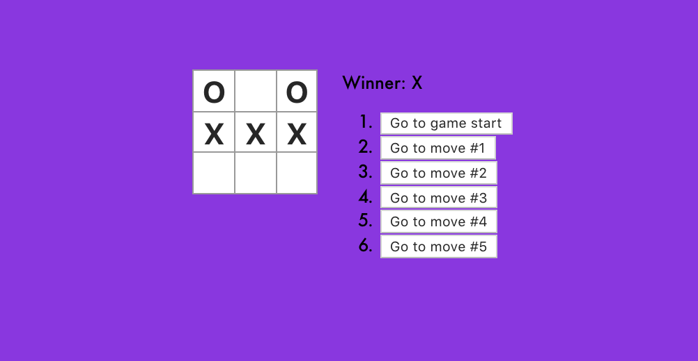

# tic-tac-toe
This application is straight from the React.js documentation! It is a local two player tic-tac-toe game that allows you to go back to any move you've made that game and will determine the correct winner based on getting 3 spots in a row.



# Steps to reproduce this application to your local machine:
1. Simply clone this repo on your desktop either using SSH or HTTPS
2. Open the cloned folder in your text editor of choice (mine happens to be WebStorm)
3. After it is loaded up onto your editor, please run an ```npm install``` in order to download the required dependencies for this small scale application.
4. When the install is complete, run an ```npm start``` to run the program into your local browser.
     - Please note that if you have a different application running on the same port you will be prompted to either run this on a different port number or to not run the app at all.
